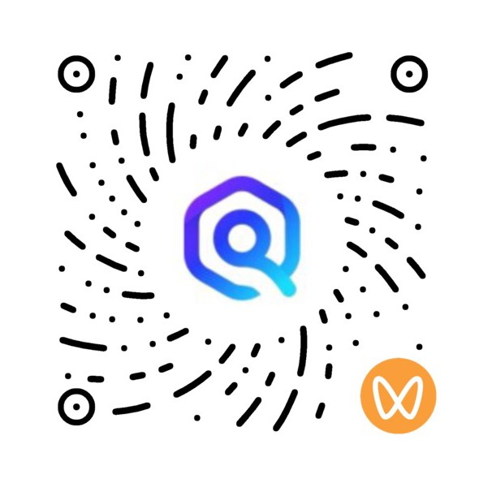

<b>English Introduction</b>

openJiuwen is an open-source community dedicated to building a production-ready AI Agent platform.

Our goal is to provide an easy-to-use, flexible, and stable foundation for developing intelligent agents, and to accelerate the adoption of commercial-grade Agentic AI technologies in real-world applications.

With openJiuwen, developers can quickly build agents that handle complex tasks, support multi-agent collaboration, and help individuals and enterprises efficiently create powerful AI Agent systems.

# System Architecture

openJiuwen adopts a layered architecture that covers the complete lifecycle of AI Agents, from development and execution to deployment, operations, and maintenance. The overall architecture consists of **DeepAgents**, **Agent Studio**, **Agent Framework**, **Agent Distributed Runtime**, and **Agent System Service**.

* **DeepAgents**: Provides complex, scenario-oriented Agents such as JiuwenSwarm, JiuwenSymbiosis, and DeepSearch, enabling out-of-the-box use.
* **Agent Studio**: A one-stop AI Agent development platform that provides low-code and no-code visual development capabilities. It supports Agent development, workflow orchestration, prompt optimization, online debugging, and resource management, helping developers quickly build and debug Agents and workflows.
* **Agent Framework**: The core framework and execution engine of openJiuwen that provides developers with intuitive APIs for building, orchestrating, and invoking AI Agents across diverse scenarios. It delivers comprehensive capabilities including complex task planning, iterative execution, tool and skill invocation, context management, memory subsystems, multi-agent collaboration, agent self-evolution, and affinity-aware scheduling, enabling the engineering of both single-agent and multi-agent applications.
* **Agent Distributed Runtime**: Provides the distributed runtime foundation for AI Agents, supporting both low-code and code-first deployment models with one-click deployment and unified lifecycle management. It natively supports multi-tenant isolation, elastic scaling, service registration and discovery, and high-performance cross-cluster communication, enabling reliable operation and large-scale deployment of enterprise-grade multi-agent systems.
* **Agent System Service**: Provides the foundational system services of AgentOS, including system-level security sandboxing, unified persistent memory storage, native CLI utilities, a standardized Agent file system, and a cross-agent message bus. These core capabilities provide a secure runtime environment, unified resource management, and efficient collaboration for AI Agents across the platform.

## Implementation Overview

openJiuwen adopts a modular repository design to build the AI Agent development ecosystem layer by layer. Each repository can evolve independently or be used in combination with others, covering the complete workflow from Agent applications, Skill distribution, and visual orchestration to framework development and service-based execution.

### Repository Overview

<table style="width: 100%; border-collapse: collapse; table-layout: fixed;">
  <colgroup>
    <col style="width: 18%;" />
    <col style="width: 26%;" />
    <col style="width: 56%;" />
  </colgroup>
  <thead>
    <tr>
      <th style="border: 1px solid; padding: 10px 12px; text-align: left; font-weight: 700;">Module</th>
      <th style="border: 1px solid; padding: 10px 12px; text-align: left; font-weight: 700;">Repository</th>
      <th style="border: 1px solid; padding: 10px 12px; text-align: left; font-weight: 700;">Description</th>
    </tr>
  </thead>
  <tbody>
    <tr>
      <td rowspan="3" style="border: 1px solid; padding: 10px 12px; font-weight: 700; vertical-align: middle;">DeepAgents</td>
      <td style="border: 1px solid; padding: 10px 12px; vertical-align: top;"><a href="https://github.com/openJiuwen/jiuwenswarm">jiuwenswarm</a></td>
      <td style="border: 1px solid; padding: 10px 12px; vertical-align: top;">A multi-Agent collaboration framework and official flagship application that supports complex task collaboration and autonomous Skill evolution.</td>
    </tr>
    <tr>
      <td style="border: 1px solid; padding: 10px 12px; vertical-align: top;"><a href="https://github.com/openJiuwen-ai/jiuwensymbiosis">jiuwensymbiosis</a></td>
      <td style="border: 1px solid; padding: 10px 12px; vertical-align: top;">An Agent framework for embodied intelligence that supports embodiment-independent capability reuse and safety control.</td>
    </tr>
    <tr>
      <td style="border: 1px solid; padding: 10px 12px; vertical-align: top;"><a href="https://github.com/openJiuwen-ai/deepsearch">deepsearch</a></td>
      <td style="border: 1px solid; padding: 10px 12px; vertical-align: top;">A knowledge-enhanced deep search and research Agent designed for search, reasoning, and report generation scenarios.</td>
    </tr>
    <tr>
      <td style="border: 1px solid; padding: 10px 12px; font-weight: 700; vertical-align: middle;">SkillHub</td>
      <td style="border: 1px solid; padding: 10px 12px; vertical-align: top;"><a href="https://github.com/openJiuwen-ai/skillhub">skillhub</a></td>
      <td style="border: 1px solid; padding: 10px 12px; vertical-align: top;">A Skill hosting and distribution platform that supports Skill publishing, version management, search and download, sharing and reuse, and private deployment.</td>
    </tr>
    <tr>
      <td style="border: 1px solid; padding: 10px 12px; font-weight: 700; vertical-align: middle;">Agent Studio</td>
      <td style="border: 1px solid; padding: 10px 12px; vertical-align: top;"><a href="https://github.com/openJiuwen-ai/agent-studio">agent-studio</a></td>
      <td style="border: 1px solid; padding: 10px 12px; vertical-align: top;">A one-stop visual Agent development platform that supports Agent editing, workflow orchestration, resource configuration, prompt optimization, and online debugging.</td>
    </tr>
    <tr>
      <td rowspan="4" style="border: 1px solid; padding: 10px 12px; font-weight: 700; vertical-align: middle;">Agent Framework</td>
      <td style="border: 1px solid; padding: 10px 12px; vertical-align: top;">agent-gateway</td>
      <td style="border: 1px solid; padding: 10px 12px; vertical-align: top;">A unified access gateway that provides Channel management, message processing, scheduled tasks, heartbeat management, and other capabilities. Currently opening soon.</td>
    </tr>
    <tr>
      <td style="border: 1px solid; padding: 10px 12px; vertical-align: top;"><a href="https://github.com/openJiuwen-ai/agent-core">agent-core</a></td>
      <td style="border: 1px solid; padding: 10px 12px; vertical-align: top;">A Python Agent SDK that provides core capabilities including Agent orchestration, runtime management, model integration, tools, retrieval, and evaluation.</td>
    </tr>
    <tr>
      <td style="border: 1px solid; padding: 10px 12px; vertical-align: top;"><a href="https://github.com/openJiuwen-ai/agent-core-java">agent-core-java</a></td>
      <td style="border: 1px solid; padding: 10px 12px; vertical-align: top;">A Java Agent SDK that provides the Java ecosystem with Agent development capabilities consistent with those of the Python SDK.</td>
    </tr>
    <tr>
      <td style="border: 1px solid; padding: 10px 12px; vertical-align: top;"><a href="https://github.com/openJiuwen-ai/agent-memory">agent-memory</a></td>
      <td style="border: 1px solid; padding: 10px 12px; vertical-align: top;">A long-term memory system for Agents that supports memory extraction, compression, hybrid retrieval, knowledge accumulation, and autonomous evolution.</td>
    </tr>
    <tr>
      <td rowspan="3" style="border: 1px solid; padding: 10px 12px; font-weight: 700; vertical-align: middle;">Agent Distributed Runtime</td>
      <td style="border: 1px solid; padding: 10px 12px; vertical-align: top;"><a href="https://github.com/openJiuwen-ai/agent-runtime">agent-runtime</a></td>
      <td style="border: 1px solid; padding: 10px 12px; vertical-align: top;">A Python Agent Runtime responsible for service-based Agent execution, session management, and lifecycle management.</td>
    </tr>
    <tr>
      <td style="border: 1px solid; padding: 10px 12px; vertical-align: top;"><a href="https://github.com/openJiuwen-ai/agent-runtime-java">agent-runtime-java</a></td>
      <td style="border: 1px solid; padding: 10px 12px; vertical-align: top;">A Java Agent Runtime based on Spring Boot that provides service-based Agent execution and deployment capabilities.</td>
    </tr>
    <tr>
      <td style="border: 1px solid; padding: 10px 12px; vertical-align: top;"><a href="https://github.com/openJiuwen-ai/agent-protocol">agent-protocol</a></td>
      <td style="border: 1px solid; padding: 10px 12px; vertical-align: top;">An Agent interoperability protocol SDK that provides the MCP SDK, A2A SDK, and A2X Registry.</td>
    </tr>
  </tbody>
</table>

# How to Contribute

For instructions on joining, please see: https://www.openjiuwen.com/contribute

# Community Communication and Exchange

If you encounter any problems while using openJiuwen, you can contact us through the following channels:

Website: https://www.openjiuwen.com

Email: contact@openjiuwen.com

<b>中文简介</b>

openJiuwen作为开源Agent平台，致力于提供灵活、强大且易用的AI Agent开发与运行能力。基于该平台，开发者可快速构建处理各类简单或复杂任务的AI Agent，实现多Agent协同交互，高效开发生产级可靠AI Agent；并助力企业与个人快速搭建AI Agent系统或平台，推动商用级Agentic AI技术广泛应用与落地。

# 系统架构

openJiuwen 采用分层架构设计，覆盖 AI Agent 从开发、运行到部署和运维的完整生命周期，整体由 **DeepAgents**、**Agent Studio** 、**Agent Framwork**、**Agent Distributed Runtime**、**Agent System Service** 组成。
- **DeepAgents**：提供面向不同场景的复杂智能体，如 JiuwenSwarm、JiuwenSymbiosis、DeepSearch 等，支持开箱即用。 
- **Agent Studio**：一站式 AI Agent 开发平台，提供低代码 / 零代码可视化开发能力，支持 Agent 开发、工作流编排、Prompt 调优、在线调试和资源管理，帮助开发者快速打造和调试智能体及工作流。
- **Agent Framework**: openJiuwen 核心框架与执行引擎，为开发者提供多场景、易用的 Agent 开发、编排与调用接口。覆盖复杂任务规划、循环执行、工具与技能调用、上下文管理、记忆子系统、多智能体协同、Agent 自演进、算力亲和调度等关键特性，全面支撑单体 Agent 到多 Agent 协同的工程化落地。
- **Agent Distributed Runtime**: 提供分布式 Agent 运行时底座，支持低码、高码两种智能体部署模式，实现 Agent 一键发布部署与全生命周期统一管控。原生内置多租户资源隔离、服务弹性扩缩容、统一注册发现、跨集群高速互通等核心能力，全面支撑大规模多 Agent 集群稳定运行、业务规模化落地。
- **Agent System Service**：AgentOS 底层基础系统服务，内置系统级安全隔离沙箱、全局统一记忆持久化存储、原生 CLI 系统工具、标准化 Agent 文件系统、跨Agent通信总线等底层核心能力，支撑全平台智能体安全运行、资源统一调度与多Agent高效协同。

## 实现概览

openJiuwen 采用模块化仓库设计，逐层构建 AI Agent 开发生态。各仓库可独立演进，也可组合使用，覆盖从智能体应用、技能分发、可视化编排、框架开发到服务化运行的完整链路。

### 代码仓总览

<table style="width: 100%; border-collapse: collapse; table-layout: fixed;">
  <colgroup>
    <col style="width: 18%;" />
    <col style="width: 26%;" />
    <col style="width: 56%;" />
  </colgroup>
  <thead>
    <tr>
      <th style="border: 1px solid; padding: 10px 12px; text-align: left; font-weight: 700;">模块</th>
      <th style="border: 1px solid; padding: 10px 12px; text-align: left; font-weight: 700;">仓库</th>
      <th style="border: 1px solid; padding: 10px 12px; text-align: left; font-weight: 700;">说明</th>
    </tr>
  </thead>
  <tbody>
    <tr>
      <td rowspan="3" style="border: 1px solid; padding: 10px 12px; font-weight: 700; vertical-align: middle;">Deep Agents</td>
      <td style="border: 1px solid; padding: 10px 12px; vertical-align: top;"><a href="https://github.com/openJiuwen-ai/jiuwenswarm">jiuwenswarm</a></td>
      <td style="border: 1px solid; padding: 10px 12px; vertical-align: top;">多智能体协同框架与官方旗舰应用，支持复杂任务协作与 Skill 自演进。</td>
    </tr>
    <tr>
      <td style="border: 1px solid; padding: 10px 12px; vertical-align: top;"><a href="https://github.com/openJiuwen-ai/jiuwensymbiosis">jiuwensymbiosis</a></td>
      <td style="border: 1px solid; padding: 10px 12px; vertical-align: top;">面向具身智能的 Agent 框架，支持构型无关的能力复用与安全控制。</td>
    </tr>
    <tr>
      <td style="border: 1px solid; padding: 10px 12px; vertical-align: top;"><a href="https://github.com/openJiuwen-ai/deepsearch">deepsearch</a></td>
      <td style="border: 1px solid; padding: 10px 12px; vertical-align: top;">知识增强型深度检索与研究 Agent，面向搜索、推理和报告生成场景。</td>
    </tr>
    <tr>
      <td style="border: 1px solid; padding: 10px 12px; font-weight: 700; vertical-align: middle;">SkillHub</td>
      <td style="border: 1px solid; padding: 10px 12px; vertical-align: top;"><a href="https://github.com/openJiuwen-ai/skillhub">skillhub</a></td>
      <td style="border: 1px solid; padding: 10px 12px; vertical-align: top;">Skill 托管与分发平台，支持 Skill 发布、版本管理、检索下载、共享复用及私有化部署。</td>
    </tr>
    <tr>
      <td style="border: 1px solid; padding: 10px 12px; font-weight: 700; vertical-align: middle;">Agent Studio</td>
      <td style="border: 1px solid; padding: 10px 12px; vertical-align: top;"><a href="https://github.com/openJiuwen-ai/agent-studio">agent-studio</a></td>
      <td style="border: 1px solid; padding: 10px 12px; vertical-align: top;">一站式可视化 Agent 开发平台，支持 Agent 编辑、工作流编排、资源配置、Prompt 调优与在线调试。</td>
    </tr>
    <tr>
      <td rowspan="4" style="border: 1px solid; padding: 10px 12px; font-weight: 700; vertical-align: middle;">Agent Framework</td>
      <td style="border: 1px solid; padding: 10px 12px; vertical-align: top;">agent-gateway</td>
      <td style="border: 1px solid; padding: 10px 12px; vertical-align: top;">统一接入网关，提供 Channel 管理、消息处理、定时任务与心跳等能力，当前 Opening Soon。</td>
    </tr>
    <tr>
      <td style="border: 1px solid; padding: 10px 12px; vertical-align: top;"><a href="https://github.com/openJiuwen-ai/agent-core">agent-core</a></td>
      <td style="border: 1px solid; padding: 10px 12px; vertical-align: top;">Python Agent SDK，提供 Agent 编排、运行时、模型、工具、检索与评测等核心能力。</td>
    </tr>
    <tr>
      <td style="border: 1px solid; padding: 10px 12px; vertical-align: top;"><a href="https://github.com/openJiuwen-ai/agent-core-java">agent-core-java</a></td>
      <td style="border: 1px solid; padding: 10px 12px; vertical-align: top;">Java Agent SDK，为 Java 生态提供与 Python SDK 一致的 Agent 开发能力。</td>
    </tr>
    <tr>
      <td style="border: 1px solid; padding: 10px 12px; vertical-align: top;"><a href="https://github.com/openJiuwen-ai/agent-memory">agent-memory</a></td>
      <td style="border: 1px solid; padding: 10px 12px; vertical-align: top;">智能体长期记忆系统，支持记忆抽取、压缩、混合检索、沉淀构建与自主演化。</td>
    </tr>
    <tr>
      <td rowspan="3" style="border: 1px solid; padding: 10px 12px; font-weight: 700; vertical-align: middle;">Agent Distributed Runtime</td>
      <td style="border: 1px solid; padding: 10px 12px; vertical-align: top;"><a href="https://github.com/openJiuwen-ai/agent-runtime">agent-runtime</a></td>
      <td style="border: 1px solid; padding: 10px 12px; vertical-align: top;">Python Agent Runtime，负责 Agent 服务化运行、会话管理与生命周期管理。</td>
    </tr>
    <tr>
      <td style="border: 1px solid; padding: 10px 12px; vertical-align: top;"><a href="https://github.com/openJiuwen-ai/agent-runtime-java">agent-runtime-java</a></td>
      <td style="border: 1px solid; padding: 10px 12px; vertical-align: top;">Java Agent Runtime，基于 Spring Boot 提供 Agent 服务化运行与部署能力。</td>
    </tr>
    <tr>
      <td style="border: 1px solid; padding: 10px 12px; vertical-align: top;"><a href="https://github.com/openJiuwen-ai/agent-protocol">agent-protocol</a></td>
      <td style="border: 1px solid; padding: 10px 12px; vertical-align: top;">Agent 互操作协议 SDK，提供 MCP SDK、A2A SDK 与 A2X Registry。</td>
    </tr>
  </tbody>
</table>

# 如何参与贡献

加入方式参见：https://www.openjiuwen.com/contribute

# 社区沟通与交流

如果您在使用openJiuwen过程中遇到问题，可以通过如下渠道联系我们。

网站： https://www.openjiuwen.com

邮箱： contact@openjiuwen.com

<!-- 左右并排 -->

	

		
		
openJiuwen公众号

	

	

		
		
openJiuwen视频号

	

